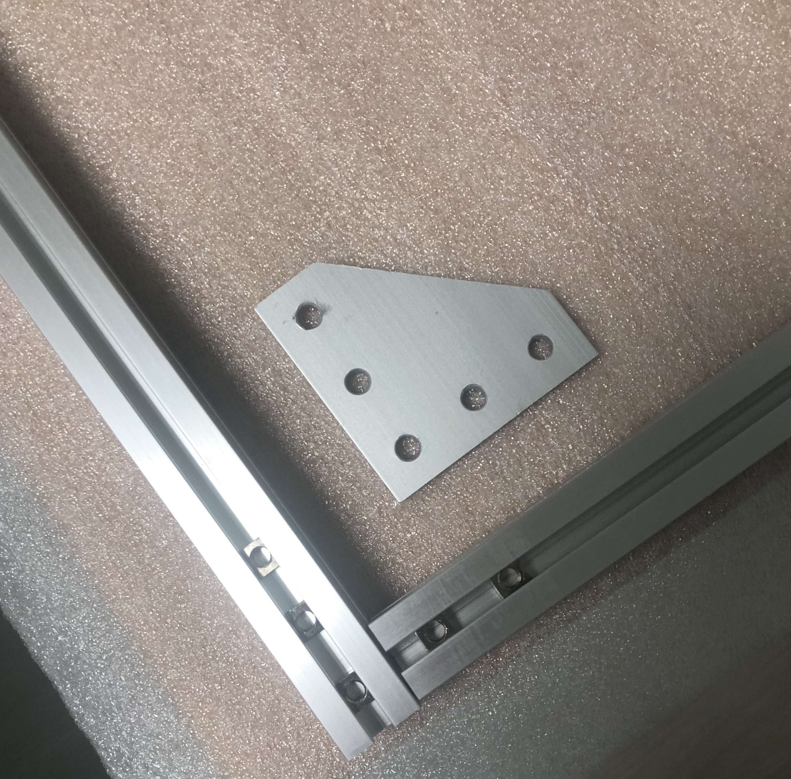
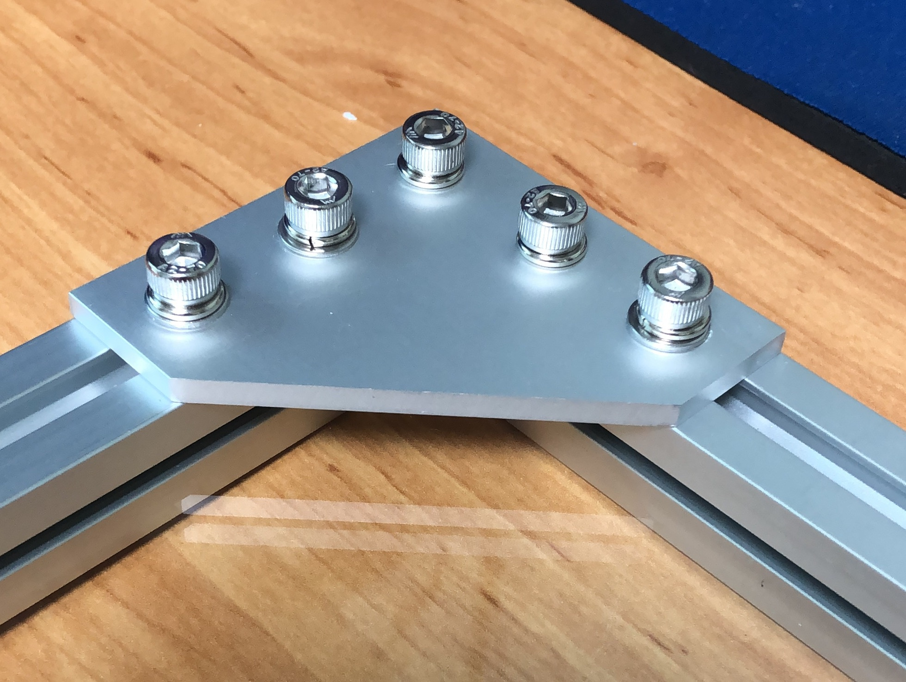
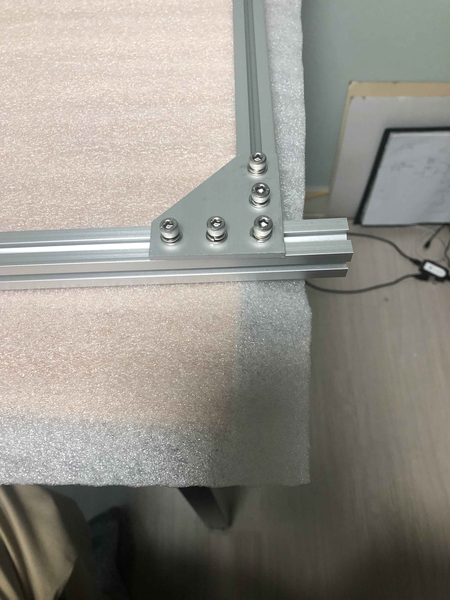
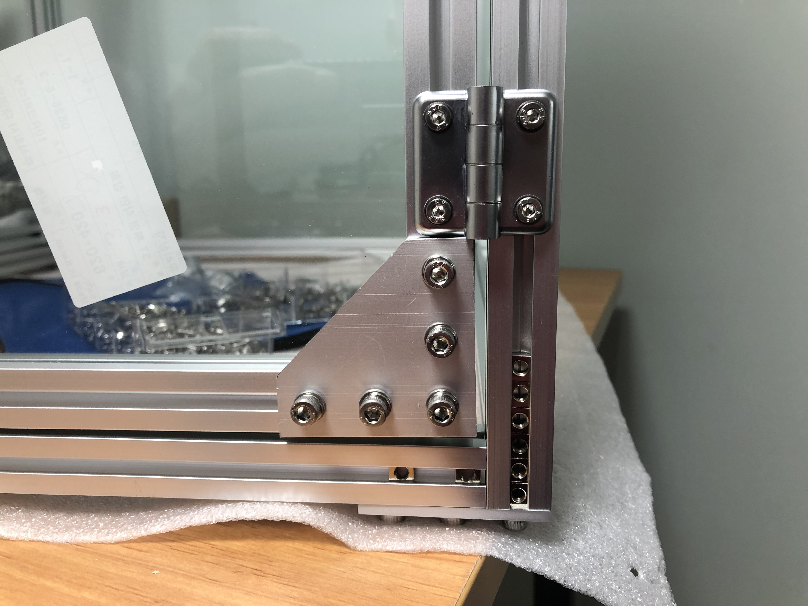
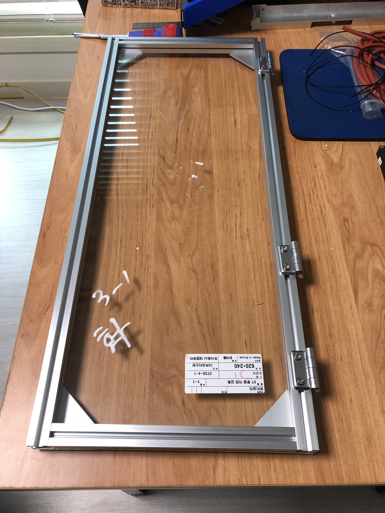
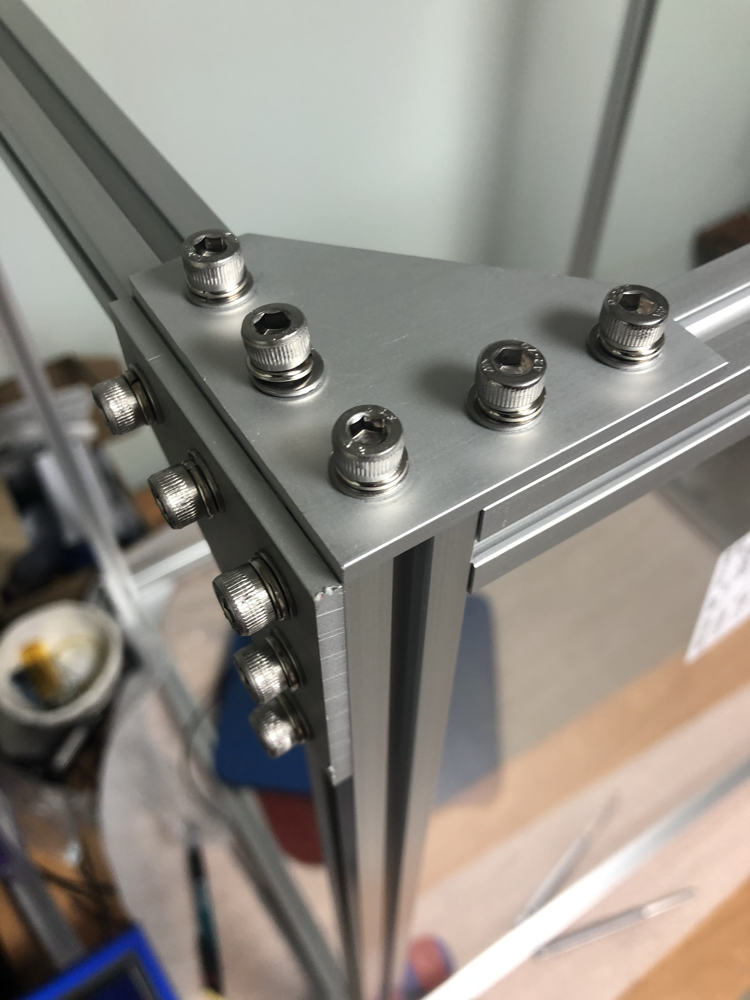
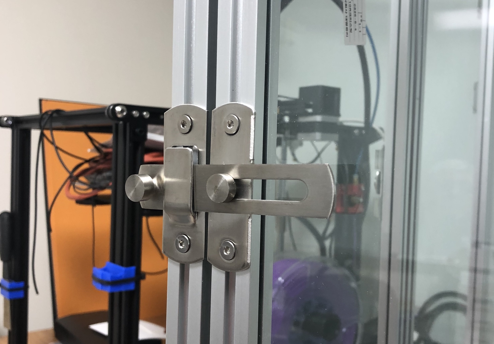
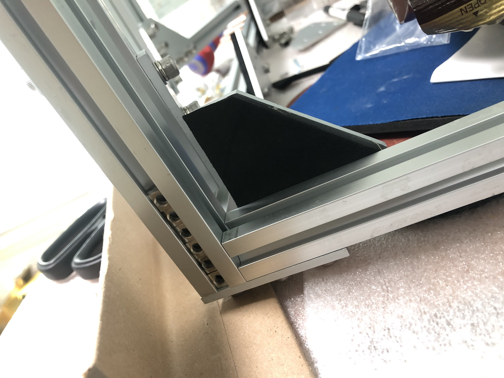

# Enclosure for 3D Printer, Assembly Steps

## Tools

Here is a list of the tools needed to assemble the enclosure:

* Hex Ball Drivers
  - 4 mm, used for M5 Socket head machine screws
  - 3 mm, used for M4 Socket head machine screws
  - 2.5 mm, used for M4 Flat Head screws
 
* M4 tap, for threading holes in the vertical posts

## Basic Plan

Individual panels are assembled first.  These are then assembled into a
cube and the rear glass is installed.  Finally, the door panels are
mounted on their hinges, and accessories like handles and latches are
installed.

  1. Make the Normal Panels
  2. Make the Oddball Panels
  3. Join the Left and Right Sides
  4. Install the Doors
  5. Accessories
  6. Optional, Future Accessories

## 1. Make the Normal Panels

The cage is composed of several pre-made panels.
Build the normal ones first, per the assembly drawing 104320.  

* FG.L - Left side panel (frame with glass)
* DR.FL - Front door, left (frame with glass)
* DR.FR - Front door, right (frame with glass)
* DR.R - Right side door (frame with glass)
* DR.T - Top door (frame with glass)

The dimensions of each panel are in the BOM spreadsheet.
The dimensions of each item in a given panel are also in the BOM, 
in the worksheet called "roll-down".

My assembly process was to assemble a "C" shape frame first.
Then slide the glass panel in the groove, along with rubber gasket
material, and finally install the fourth frame side to complete the
panel.

In addition to the square nuts required for the corner brackets,
other square nuts may be required for other, top-level, assembly steps.
If you forget, it's not a show-stopper.  You can open a corner and
insert missing square nuts later on in the process, but that's awkward.
These extra nuts are marked on the top-level assembly drawing (TBD).

#### Example corner before installation

#### Frame corner detail

#### Corner can slide

#### Better not forget the square nuts

#### Too many square nuts

#### Completed front door panel

#### Glass panels assembled

## 2. Make the Oddball Panels

There are several oddball panels, basically partial panels which were
conceptualized to make the top level assembly drawing and parts list a
little less cluttered.  All but the right-side panel are constructed
in-place as the enclosure is assembled.  But the right-side panel is
stand-alone, so build that now.

* FX.R - Right side panel (frame, no glass)

Note: The four corners of this panel will eventually be removed, once it is
put into the final assembly.

The rest of these oddball panels are:

* PS.K - Rear face of enclosure, glass only
* PS.T - Top of enclosure, two rails and four corners only
* PS.B - Botton of enclosure, two rails and four corners only

## 3. Join the Left and Right Sides

Using the four rails which make up the top and bottom sides, join the
left and right sides of the enclosure.  Don't put the top rear rail on
until you install the rear glass panel and gasketing.

#### Cube assembled, time to tap the holes

Note, before proceeding to install the doors, thread the center holes of
the four vertical rails with an M4 tap, eight places.  The bottom four
tapped holes can be used to hold feet.  The top four holes are just used
to hold the corner brackets in place.

Once the eight corner plates are installed top and bottom, thus making a
cube, remove the four outward-facing corners on the right side frame.
This allows the right side door to open and close.

#### Completed corner, upper right side

## 4. Install the Doors

Install the two front doors and the side door using hinges and mounting
hardware as indicated in the drawing and parts list.  The top door must
use a hinge with different rail-to-rail spacing, or optionally a spacer
piece of 2020 profile can be screwed along the top rear rail to give
enough offset so the same hinges can be used.  The vertical door hinges
give a 5mm gap between the door and frame.  For the top door, this is
not enough clearance for the corner brackets and socket-head cap screws.
In addition, I wanted extra clearance here for cables.  I went with a
larger hinge, giving a 20 mm gap between the door and frame top.

#### Almost There

#### Rear hinge detail

## 5. Accessories

You can accessorize this until the cows come home.  I added a latch to
hold the doors closed.  Some door stops I made from extra corner
brackets and some closed-cell foam.  I put some handles on the top
rails, this thing is heavy and you and a friend need a strong grip to
lift it.  I also put some rubber feet to use a spacers along the front
of the top door to maintain the 20 mm gap spacing.  And finally, I put
rubber feet on the bottom four corners.

#### Front door stop detail

#### Door latch detail

#### Door stop detail

#### Top door bumpers, left

#### Top door bumpers, right

## 6. Optional, Future Accessories

In the future, I would like to add a spring or bungee cord to the doors 
to hold them shut.  I'm not crazy about the latches I bought, I would
either replace them or maybe just live with spring action to hold the
doors shut.  One friend has recommended a fire extinguisher ball. And I
still have to mount the various 3D printer accessories, such the
Raspberry Pi 4 Octoprint server, camera, and LED lighting.

