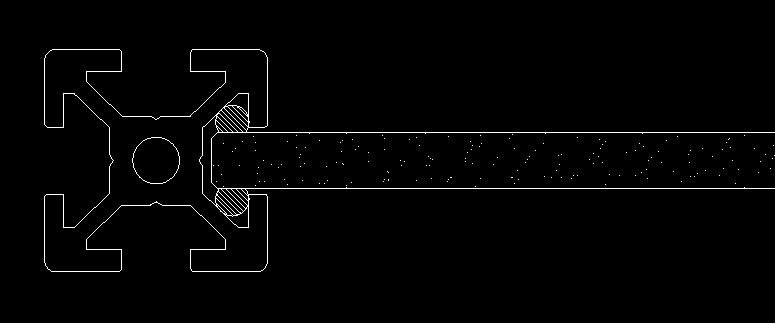

# Calling it Done
_24-Sep-2020_

Belatedly wrapping this up.  There are still small tweaks I'd like to do
here and there, but that will never stop.  Updated drawings, pictures,
and provided assembly instructions.

# Almost Complete
_17-Sep-2020_

Typhoon spared my local town.  Been busy with other things, but finally
got the bulk of the cage assembled.

# Design Details Updated, Video Soon
_07-Sep-2020_
Added some design details to the repo.  Been working on an exploded view
render from OpenSCAD.  Should have it ready tomorrow.  Work and a
nearby typhoon delayed final assembly of the cage another day or two -
that's life.

# Panels a Plenty
_05-Sep-2020_

Built up all the glass panels today.

I'll begin the final assembly tomorrow.

Also updated the repository with a final assembly drawing and made a few
BOM corrections.

# A $30 Typo
_01-Sep-2020_

As I started to assemble the first panel tonight, I found yet another
mistake.  I ordered two of the larger panels incorrectly. In this case,
it was an error when I rolled up the various Parts Lists into a
to-purchase BOMs.  It was an extremely unlucky typo - neither of the two
panes were the correct size. 

Ordered:
* 2 ea 640 x 470 mm panes

Needed:
* 1 ea 670 x 470
* 1 ea 670 x 570

I will plow ahead building what I can, new panes on order, should arrive
before Friday if I'm lucky.  Repo updated with revised BOM.

# Project Repository Goes Live
_01-Sep-2020_

Did some cleanup of the files and organization, pushed a project
repository on GitHub.  This repository includes some more photos (I
think I've maxed out the gallery space on Hackaday.io), the OpenSCAD
files, and a 2D CAD drawing ( DWG, DXF, and PDF) of the panel.  The
panels form the basic building blocks of the design.

Yet to do, documentation-wise:

* complete and upload the final assembly drawing
* notes and comments on the design
* explanation of some of the OpenSCAD craziness

As for the enclosure, the remaining six rails of the correct length will
arrive today. I will start assembling everything tonight.  I should have
it assembled and running by the weekend, knock on wood.

# Incoming Inspection
_30-Aug-2020_

Almost all the remaining parts arrived Friday.  A bundle of
cut-to-length 2020 profiles, and the tempered glass panels.  See
gallery.

Despite triple checking my numbers, I mis-ordered on length of profile,
requesting 630 instead of 650mm.  Corrected pieces ordered Saturday,
should get here Monday or Tuesday.

I also had one heck of a time with gasket materials to keep the glass
securely in place.  As you will see (when I finally upload my drawings),
I had a careful plan that a pair of 3mm gaskets with circular
cross-sections would be perfect.  Alas, it proved to be a bear to
install them.  First problem was how to install the gaskets.  I
basically had two cylindrical rubber "ropes" that I had to squeeze in
between the glass edges and the insides of the 2020 profile.  This was
proving to be quite awkward.  The second problem was even when I had
only one gasket installed, the force required to bring the frame corners
together was scary. 

In the end, I decided this idea was overkill.  Unlike ordinary gaskets
on windows, whose goal is to prevent leaks, in my application the main
function is to just keep the glass from rattling in the frame.  I pulled
most of the gasket material, and just left a short pieces along each
edge.  Problem solved.

This discussion might be getting ahead of myself, since I still haven't
posted drawings yet, but you can get the idea of the problem from this
sketch above and picture of the test panel in the gallery (that test
panel didn't have any gasket, and taught me that I needed one).

# The Fun Begins
_26-Aug-2020_

I've been curious for some time about 3D printers, but never took the
plunge until the virus hit.  Back in March, a friend of mine pointed out
that he was making miniature people, cars, and buildings for his
HO-gauge model railroad layout using a $300 printer from China.  I knew
the time had come.  His model was the Ender 3, but I splurged and got
the Ender 5 Pro.  

Shortly after receiving my new printer, another friend told me I needed
an enclosure, advice that I kept putting off until I realized he was
right.  After doing a little research, I wasn't really impressed with
any of the off-the-shelf solutions.  Having an enclosure that was not
flammable seemed to be desirable, but many of the popular ones weren't.
Building my own seemed an option, but I imagined complex 3D pieces to
join panes of glass together at the corners began to worry me. And any
"good" enclosure needs doors, panels, mounting points for accessories,
etc.  

Then suddenly, I had an idea ... use the same type of aluminum
extrusions that comprised the 3D printer as frames for a glass
enclosure. and it seemed much more approachable.  This hack page will
force me to document my project, and hopefully nag me to wrap it up
sooner than later.

The main design is locked in.  I was a little worried about a few
educated guesses I made in the design, so I built a small test panel.
Surprisingly, everything went together as expected.  The only tweak was
one I had planned for, that was selecting the type and size of packing
to keep the glass from rattling in the frame.  I have all the hardware
in-hand, and pulled the plug on the extrusions and glass panels
yesterday.

I have a substantial part of the documentation already completed.  This
includes a BOM, with part information and data sheets, and CAD drawings
in DWG/DXF format (assembly drawings) and OpenSCAD for 3D modeling and
exploded view animation.  I'll try to post an update every couple of
days until it's all built and in-service.

