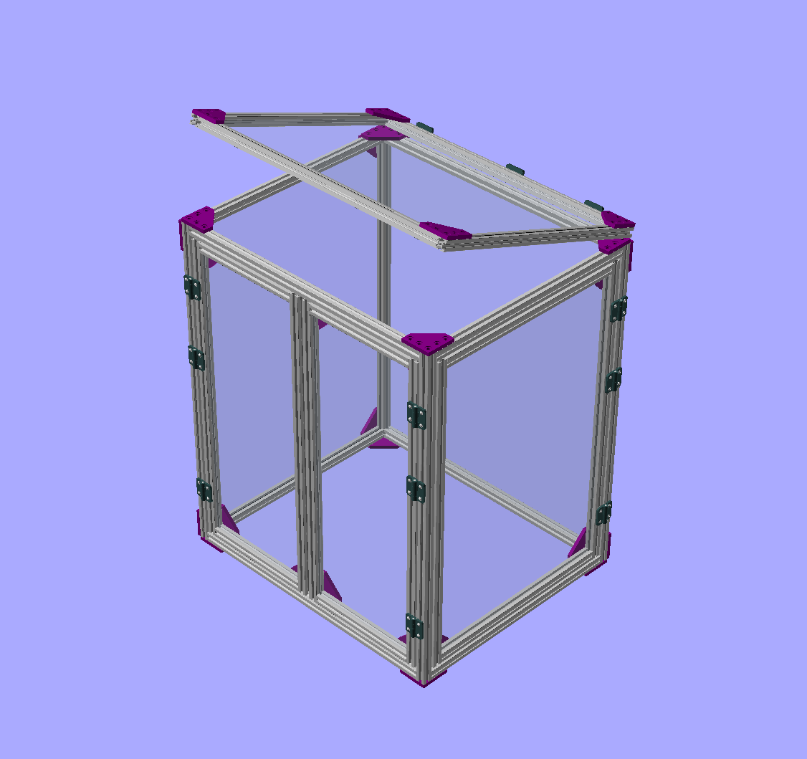

# Gallery of pictures

Just a markdown file to access the images, and a place to put comments
about the photos when appropriate.

### What Am I Making?

### First Test

Before jumping into the deep waters, I made a test panel first.
This is the smallest panel in the design, one of the front doors.

### Candidate cast aluminum corners

I passed on these despite them being really cool

### Detailed views

Frame corner detail:

Frame hinge detail:

### I Hate Rubber Gaskets

My plan for rubber gaskets didn't go well.  

### Arriving Parts, Glass Panels

Surprisingly they didn't break

All unwrapped and dimensions checked

We have to separate our recycling here in South Korea

### Arriving Parts, Extrusions

### Misc stuff

