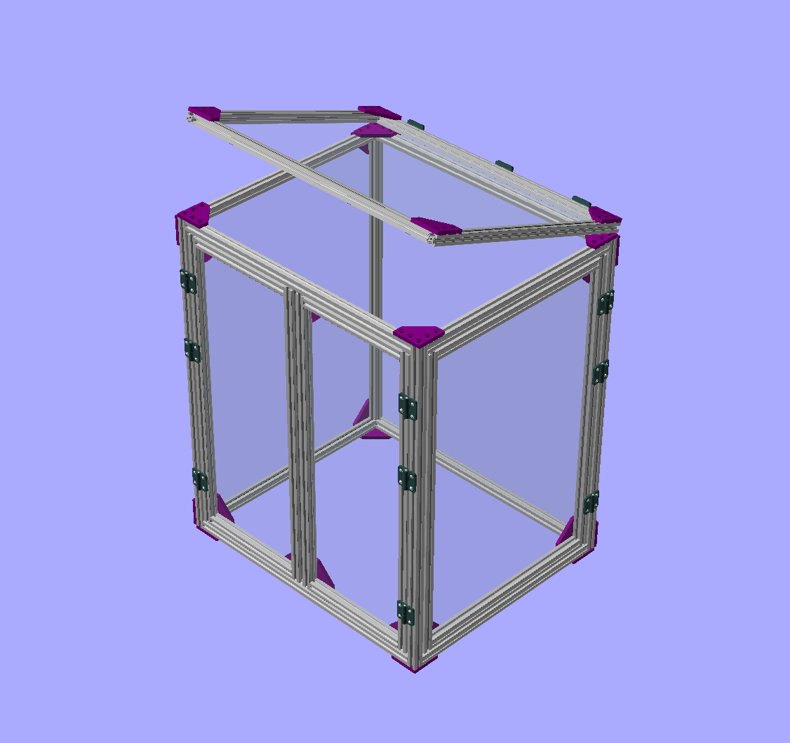

# A Novel 3D Printer Enclosure

## Overview

This is an enclosure, or cage, for my 3D printer which I designed with
an eye towards not burning down the house.  I make no claim that it
meets any real fire-proofing codes, but I tried to select material which
wasn't going to burst into flames easily.

The target 3D printer is an Ender 5 Pro.  I suspect the dimensions of
this enclosure would work with several different printers.  If you
simply want to change the size, that is easy to do in the OpenSCAD file.
If you want to change the design, as in different number and kinds of
doors, you'll need more than a passing familiarity with OpenSCAD.

## Background

I've been curious for some time about 3D printers, but never took the
plunge until the virus hit.  Back in March, a friend of mine pointed 
out that he was making minuature people, cars, and buildings for his 
HO-gauge model railroad layout using a $300 printer from China.  
I knew the time had come.  His model was the Ender 3, but I splurged and
got the Ender 5 Pro.  

Shortly after receiving my new printer, another friend told me I needed
an enclosure, advice that I kept putting off until I realized he was
right.  After doing a little research, I wasn't really impressed with
any of the off-the-shelf solutions.  Having an enclosure that was not
flammable seemed to be desirable, but many of the popular ones weren't.  

I found a [discussion on reddit](https://www.reddit.com/r/3Dprinting/comments/6cn21j/has_anyone_built_a_fire_retardant_enclosure_for)
regarding fire-resistant boards which sounded promising. But I wasn't
readily able to find any cheaply here in South Korea.  I saw some people
were using plexiglass, but that's just plastic and would burn.
Then suddenly I realized that I could use tempered glass.
But I imagined the complex 3D pieces that would join panes of glass
together at the corners forming an enclosure, I became discouraged.  
Such a scheme would also need to accomodate doors, panels, mounting 
points for accessories, and I was about to abandon the idea.

Then I had another idea - use the same type of aluminum extrusions 
that comprised the 3D printer itself as frames for a glass enclosure.
This appeared to solve all my objections of custom joinery, and it
seemed to me, an electronics engineers, as a doable solution with
low-risk of failure.  But simple as it seemed, I was concerned about
building something like this without a metal working shop.

A bit of an aside, South Koreans are not really into the DIY scene.
Finding supplies that would be trivial to get in the US can be
challenging, if not impossible here.  In addition, without a workshop
here, extensive cutting, drilling, etc., is a non-starter.  To my
surprise, I was quickly able to find what I needed online, from
suppliers who did custom orders.  There are shops selling aluminum 2020
extrusions cut to custom lengths.  I also found a place that would cut
sheets of tempered glass to custom sizes, chamfers, and radii on
request.  With these newly-found resources at my fingertips, I was
encouraged to proceed.  

## See also:

* [Assembly instructions](assembly.md) guide on assembling the cage
* [Installation notes ](install.md) how to install the code, too basic
* [Gallery of pictures](gallery.md) an index into the pictures directory with some organization
* [Vendors used](vendors.md) list of vendors and links, useless unless you live in South Korea
* [Build log](build-log.md)
* [Design details](design.md)
* Datasheets directory (needs a few more datasheets)

## Design files:

* `cage.scad` OpenSCAD file
* `cage-bom.xlsx` BOM listing
  - `cage-bom-*.txt` intermediate bom text files generated by OpenSCAD
* `cage-panel.dwg` (also DXF and PDF files) drawing for basic panel

